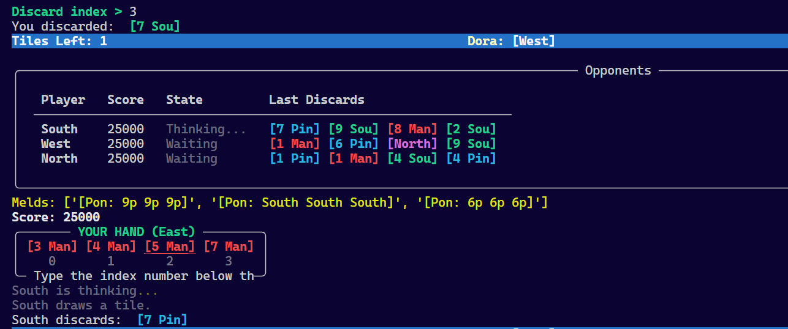

# Riichi Mahjong

An implementation of Riichi Mahjong with AI opponents.

The game features a fully functional CLI interface and a **decoupled architecture** that separates game logic from UI, making it easy to build custom AI agents.

## Project Structure

```
riichi-mahjong/
├── backend/              # Backend server and game logic
│   ├── ai/               # AI agent implementations
│   │   ├── agent.py      # Abstract base Agent class
│   │   ├── random_agent.py    # Random decision-making bot
│   │   ├── human_cli_agent.py # Human player via CLI
│   │   ├── mcts.py       # Monte Carlo Tree Search (template)
│   │   └── minimax.py    # Minimax search (template)
│   ├── core/             # Game logic and rules
│   │   ├── game_state.py    # Immutable state snapshots & actions
│   │   ├── game_engine.py   # Pure game logic (no I/O)
│   │   ├── game_controller.py # Orchestrates engine + agents
│   │   ├── tiles.py      # Tile definitions
│   │   ├── player.py     # Player state management
│   │   ├── wall.py       # Wall and dead wall
│   │   ├── shanten.py    # Shanten calculator
│   │   ├── scorer.py     # Yaku detection and scoring
│   │   └── ui.py         # CLI display functions
│   ├── server/           # Flask/WebSocket server
│   └── tests/            # Unit tests
├── frontend/             # Web-based UI (in development)
├── examples/             # Example code for AI development
│   ├── custom_ai_example.py      # How to create your own AI
│   └── engine_direct_example.py  # Direct engine control for training
└── main.py               # Main entry point
```

## Features

-   Complete Riichi Mahjong ruleset
-   Fully playable via command-line interface
-   **Decoupled Architecture**: Game logic separated from UI
-   **AI-Ready**: Simple interface for building custom AI agents
-   Hand evaluation and scoring system
-   Shanten calculation
-   Multiple AI opponents (Random, Minimax, MCTS templates)
-   Real-time multiplayer via WebSockets (planned)
-   Browser-based interface (planned)



## Architecture

The project uses a **decoupled architecture** that separates concerns:

### Core Components

-   **GameEngine**: Pure game logic with no I/O. Manages game state, validates actions, and emits events.
-   **GameState**: Immutable snapshots of game state for AI decision-making and serialization.
-   **Action**: Represents all possible player actions (discard, pon, chi, kan, riichi, etc.)
-   **GameController**: Orchestrates the game loop, connecting engine with agents and UI.

### Agent Interface

All players (human or AI) implement the simple `Agent` interface:

```python
from backend.ai import Agent
from backend.core import GameState, Action, AvailableActions

class MyAI(Agent):
    def choose_action(self, state: GameState, available_actions: AvailableActions) -> Action:
        # Analyse state, return an action
        pass
```

## Getting Started

### Prerequisites

-   Python 3.11 and above
-   Modern web browser (for future web interface)

### Installation

1. Clone the repository

```bash
git clone https://github.com/mjsandagi/riichi-mahjong.git
```

2. Install Python dependencies via the `requirements.txt` file

```bash
pip install -r requirements.txt
```

3. Run the CLI game

```bash
python main.py
```

### Command Line Options

```bash
python main.py              # Play CLI game (human vs 3 bots)
python main.py --test       # Run a test game with all bots
python main.py --simulate 100   # Run 100 simulated games
python main.py --help       # Show help
```

## Direct Engine Access (for Training)

For reinforcement learning or simulations, use the engine directly:

```python
from backend.core import GameEngine, GamePhase, Action, ActionType

engine = GameEngine()
engine.setup()

while not engine.is_game_over:
    # Advance to decision point
    if engine.phase == GamePhase.DRAW:
        engine.advance_to_next_decision()

    # Get state and make decision
    state = engine.get_state()
    action = my_policy(state)  # Your RL policy

    # Apply action
    engine.apply_action(action)

    # Clone for lookahead (MCTS/Minimax)
    simulated = engine.clone()
```

## AI

The project shall include three common implementations:

-   **RandomAgent**: Makes random valid decisions (baseline)
-   **MCTSAgent**: Monte Carlo Tree Search
-   **MinimaxAgent**: Minimax with alpha-beta pruning

## Testing

Run the test suite:

```bash
pytest backend/core/tests/
```

## Web Interface

Web interface coming soon after AI development is complete.
